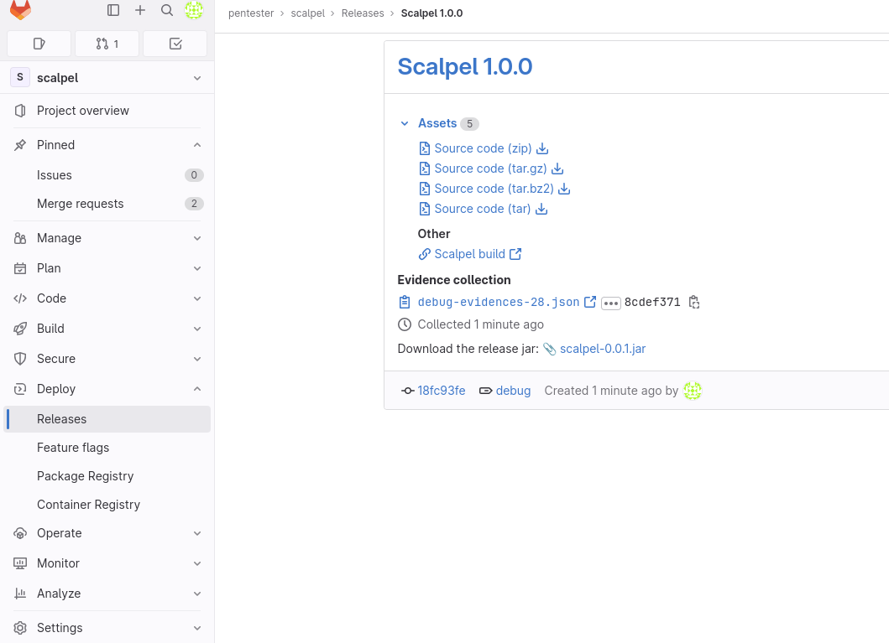
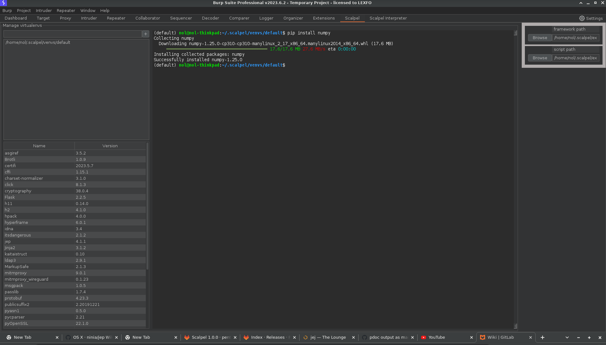

# Install

-   Install openjdk >= 17, python >= 3.10, pip and venv
-   Download the release .jar 
-   Import the .jar in Burp 
-   Wait for the dependencies to install 
-   It should look like this when Scalpel is properly initialized 
-   If Scalpel is properly installed, you should now have a "Scalpel" tab in the Request/Response editor 
-   You should also have a Scalpel config tab where you have a terminal you can use to install new packages 
-   See [Usage](usage.md) to know how to use Scalpel.
