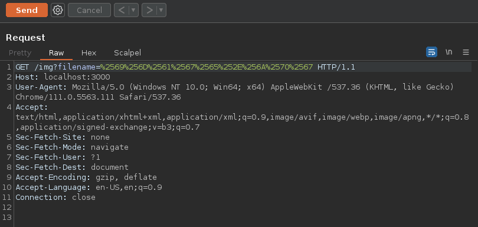
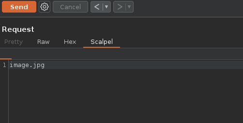
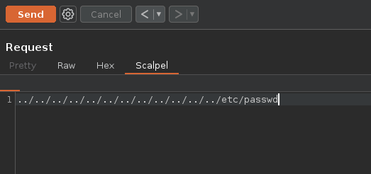
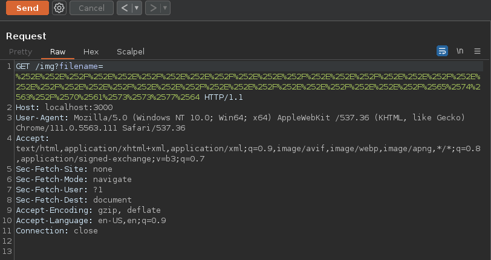
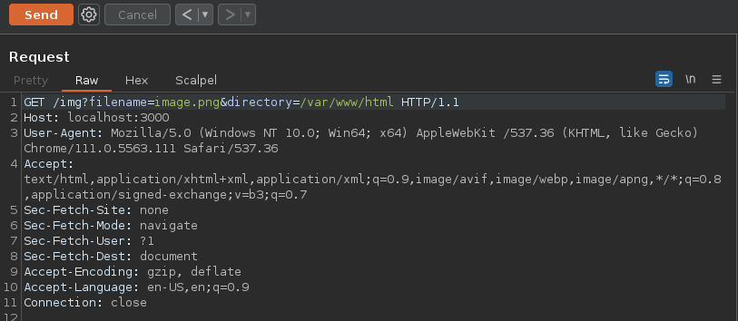
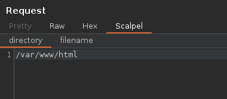

# Usage

-   Scalpel allows you to programatically intercept and modify HTTP requests and response that goes through Burp as well as creating custom request/response editors with Python.

-   To do that you simply have to write a Python script containing your code in functions that followed defined names and load the file with Scalpel through Burp GUI: 
-   You can intercept requests/response by creating a `request()` and `response()` functions in your script:

    -   E.g: Hooks that adds an arbitrary header to every requests and response:

    ```python
        from pyscalpel.http import Request, Response

        # Intercept the request
        def request(req: Request) -> Request:
            # Add an header
            req.headers["X-Python-Intercept-Request"] = "request"
            # Return the modified request
            return req

        # Same thing for response
        def response(res: Response) -> Response:
            res.headers["X-Python-Intercept-Response"] = "response"
            return res
    ```

-   You can choose whether to intercept an HTTP message by declaring a `match()` function:

    -   E.g: A match intercepting requests to localhost / 127.0.0.1 only

        ```python
        from pyscalpel.http import Flow

        def match(flow: Flow) -> bool:
            # True if host is localhost or 127.0.0.1
            return flow.host_is("localhost", "127.0.0.1")
        ```

## Editors

-   Scalpel's main _killer feature_ is the ability to program your own editors using simple Python

    -   E.g: A simple example script that allows you to edit a fully URL encoded query string parameter in a request:

        ```python
        from pyscalpel.http import Request
        from pyscalpel.utils import urldecode, urlencode_all


        # Hook to initialize the editor's content
        def req_edit_in(req: Request) -> bytes | None:
            param = req.query.get("filename")
            if param is not None:
                return urldecode(param)

            # Do not modify the request
            return None

        # Hook to update the request from the editor's modified content
        def req_edit_out(req: Request, modified_content: bytes) -> Request:
            req.query["filename"] = urlencode_all(modified_content)
            return req
        ```

    -   If you open a request with a "filename" query parameter, a "Scalpel" tab should appear in the editor 
    -   Your `req_edit_in()` python hook will be invoked and the tab should contain the filename parameter URL decoded content 
    -   Which you can modify to update the request and include anything you want (e.g: path traversal sequences) 
    -   When you send the request or switch to another editor tab, your python hook `req_edit_out()` will be invoked to update the parameter. 

-   You can have multiple tabs by adding a suffix to your function names:

    -   E.g: Same script as above but for two parameters "filename" and "directory"

        ```python
        from pyscalpel.http import Request
        from pyscalpel.utils import urldecode, urlencode_all

        def req_edit_in_filename(req: Request):
            param = req.query.get("filename")
            if param is not None:
                return urldecode(param)

        def req_edit_out_filename(req: Request, text: bytes):
            req.query["filename"] = urlencode_all(text)
            return req


        def req_edit_in_directory(req: Request):
            param = req.query.get("directory")
            if param is not None:
                return urldecode(param)


        def req_edit_out_directory(req: Request, text: bytes):
            req.query["directory"] = urlencode_all(text)
            return req
        ```

    -   You will have a tab for the "filename" parameter and a tab for the "directory" parameter
        
        

## Notes:

-   If your hooks returns `None`, it will pass the original object without any modification

    -   If `request()` returns `None`, the original request will be forwarded without modifications.
        -   Same for `response()`
    -   If `req_edit_in()` or `res_edit_in()` returns `None`, the editor tab will not be displayed
    -   If `req_edit_out()` or `res_edit_out()` returns `None`, the request will not be modified.
    -   If `req_edit_out()` / `res_edit_out()` isn't declared but `req_edit_in()` / `res_edit_in()` is, the corresponding editor will be read-only.

-   You do not have to declare every hook if you don't need them, if you only want to modify requests, you can declare the `request()` hook only.
